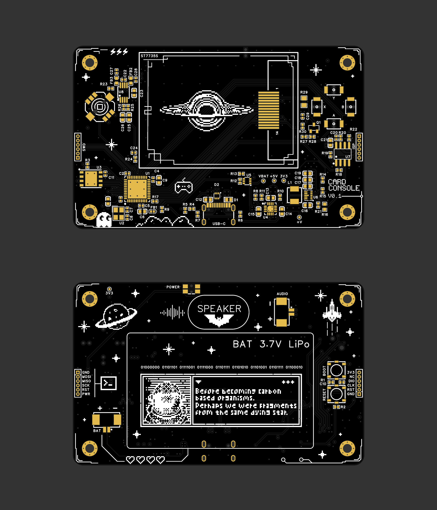

# STM-boy

STM-boy is a credit-card-sized STM32 handheld console and embedded systems
learning platform. It combines a color TFT display, USB-C, external SPI flash,
amplified audio, LiPo power management, and a dedicated hardware power
controller on a compact custom PCB.

> Status: hardware rev v0.1 is documented. The firmware in this repository is
> currently a breadboard validation sketch, not a finished console firmware.

## Highlights

- STM32F411CEU6 main MCU.
- 1.8 inch ST7735S 128x160 color TFT display.
- USB Type-C for power, USB device mode, and firmware update workflows.
- W25Q128 external SPI flash for game assets and persistent storage.
- PAM8302AASCR class-D audio amplifier for a compact speaker.
- BQ24075 power-path LiPo charger and TPS63802 3.3 V buck-boost regulator.
- ATTINY13A-based soft power controller for shutdown and low-power storage.
- Dedicated SWD pads for development, recovery, and debugging.
- Breadboard prototype sketch for display, controls, flash, and UI testing.

## Hardware Overview

| Block | Main parts | Notes |
| --- | --- | --- |
| MCU | STM32F411CEU6 | Main application processor. |
| Display | ST7735S TFT | SPI display with PWM-controlled backlight. |
| Controls | 5-way joystick, A/B/X/Y buttons | Classic handheld console layout. |
| Storage | W25Q128JVPIQ | 16 MB SPI flash for assets, logs, or game data. |
| Audio | PAM8302AASCR | Amplified speaker output from MCU PWM audio. |
| Power path | BQ24075RGTR | USB/battery power-path management and LiPo charging. |
| Regulation | TPS63802DLAR | 3.3 V buck-boost rail from USB or battery. |
| Power control | ATTINY13A-SSU | Soft on/off controller inspired by LTC2954 behavior. |
| Debug | SWD pads | SWDIO, SWCLK, SWO, NRST, 3V3, GND. |

See [docs/hardware-overview.md](docs/hardware-overview.md) for the functional
block description and design notes.

## Repository Layout

| Path | Contents |
| --- | --- |
| [hardware/pcb](hardware/pcb) | PCB source/export files, schematics, PCB PDF, BOM, and Gerbers. |
| [hardware/mechanical](hardware/mechanical) | 3D models, enclosure/front-panel files, and mechanical assembly notes. |
| [hardware/breadboard](hardware/breadboard) | Breadboard validation firmware, wiring notes, and demo GIF. |
| [docs](docs) | Project documentation, pinout, bring-up notes, and open hardware checklist. |
| [PCB_design.png](PCB_design.png) | Main visual preview for the board. |

## Start Here

- Review the project architecture in
  [docs/hardware-overview.md](docs/hardware-overview.md).
- Check PCB and breadboard pin assignments in [docs/pinout.md](docs/pinout.md).
- Before powering a new PCB, follow [docs/bring-up.md](docs/bring-up.md).
- Review mechanical/CAD notes in [docs/mechanical.md](docs/mechanical.md).
- Check current hardware status in [docs/revisions.md](docs/revisions.md).
- For fabrication files and notes, see [hardware/pcb/README.md](hardware/pcb/README.md).
- For the breadboard prototype, see
  [hardware/breadboard/wiring.md](hardware/breadboard/wiring.md).

## Current Artifacts

- Editable PCB project: [hardware/pcb/stm_boy_proj.epro](hardware/pcb/stm_boy_proj.epro)
- Schematic PDF: [hardware/pcb/schematics.pdf](hardware/pcb/schematics.pdf)
- PCB layout PDF: [hardware/pcb/pcb.pdf](hardware/pcb/pcb.pdf)
- Bill of materials: [hardware/pcb/BOM.csv](hardware/pcb/BOM.csv)
- Gerber archive: [hardware/pcb/Gerber_file.zip](hardware/pcb/Gerber_file.zip)
- Mechanical/CAD package: [hardware/mechanical](hardware/mechanical)
- Breadboard test firmware:
  [hardware/breadboard/test_firmware.cpp](hardware/breadboard/test_firmware.cpp)

## Public Release Checklist

The repository already has the most important hardware artifacts: source design,
schematics, PCB PDF, BOM, Gerbers, and breadboard test firmware.

Before calling it a polished open hardware release, add or finish:

- Assembly drawings, pick-and-place files, and manufacturing notes.
- Acrylic/front-panel drawings if the transparent cover is part of the design.
- A tested bring-up log with voltage, current, charging, display, flash, audio,
  and USB checks.
- At least one release package containing Gerbers, BOM, placement files,
  schematics, and source design files for the same hardware revision.

See [docs/open-hardware-checklist.md](docs/open-hardware-checklist.md) for the
full checklist.

## License

This repository uses a split-license model. See [LICENSE.md](LICENSE.md) for the
full scope.

- Hardware design files and fabrication outputs: CERN-OHL-S-2.0.
- Firmware and software: MIT.
- Documentation, images, and media: CC BY 4.0.
